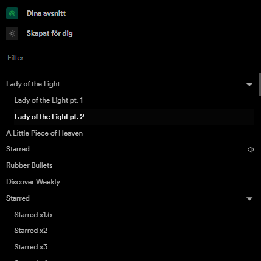
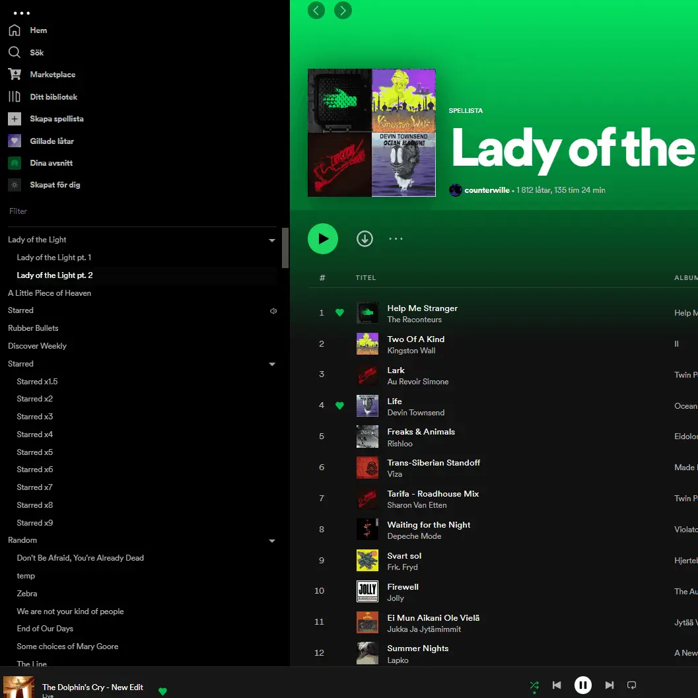
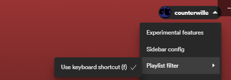

# Spicetify-playlist-filter

Adds filtering to the playlists panel to quickly find playlists by name without using the search box. 




Adds keyboard shortcut F to focus on filter input field. It can be turned off through the spicetify settings.


# Installation

- Copy `./dist/playlist-filter.js` to `~/.spicetify/plugins`
- run:

```
spicetify config extensions playlist-filter.js
spicetify apply
```

or install through [spicetify marketplace](https://github.com/CharlieS1103/spicetify-marketplace)

# Available css selectors
```
#playlist-filter-main-container

#playlist-filter-input

#playlist-filter-clear-btn

#playlist-filter-divider

#playlist-filter-results-divider-container

#playlist-filter-results-divider-gradient

#playlist-filter-results

.playlist-filter-results-list-item

.playlist-filter-results-playlist-item

.playlist-filter-results-playlist-link

.playlist-filter-results-playlist-name

.playlist-filter-results-highlight
```
See [./img/css-selectors.png](./img/css-selectors.png) for a visual representation of the css selectors.

# TODO:

- Add right click menue to filtered playlist
- Make it possible to drag-add tracks to playlists through filtered result
-

# Made with spicetify Creator

Spicetify Creator is a tool to compile modern Typescript/Javascript code to Spicetify extensions and custom apps. 

## Features

- Typescript and React syntax
- Import node packages
- CSS/SCSS with PostCSS support
- Extremely fast compile time with esbuild.
- Plugins

## Docs

Check out [Spicetify's docs](https://spicetify.app/docs/development/spicetify-creator/the-basics)!

## Available scripts

- `build`: Compiles the extension to spicetify
- `build-local`: Compiles the extension to ./dist folder
- `watch`: Compiles the extension to spicetify and watches for changes
- `watch-local`: Compiles the extension to ./dist folder and watches for changes
